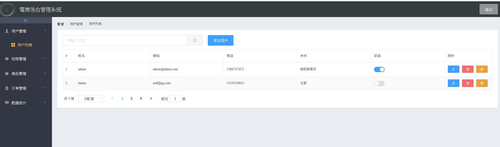

A backend admin system for shop using `vue` + `vue router` + `axios`+ `elementUI` + `echart` to build up the application, backend is using `express + MySQL` 


## Project setup
```
npm install
```

### Compiles and hot-reloads for development
```
npm run serve
```
screen shot<br/>

